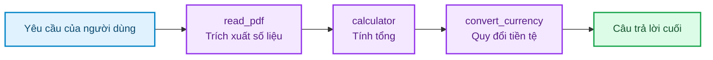
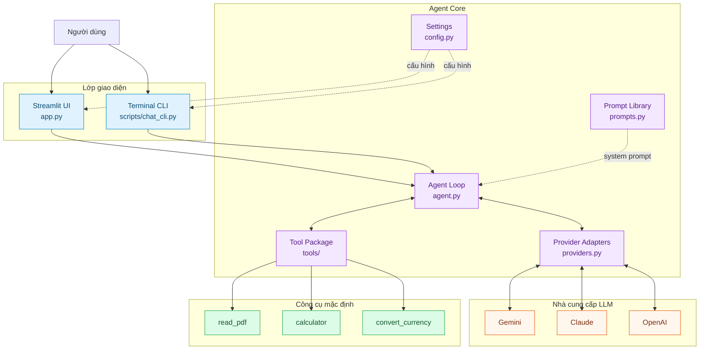
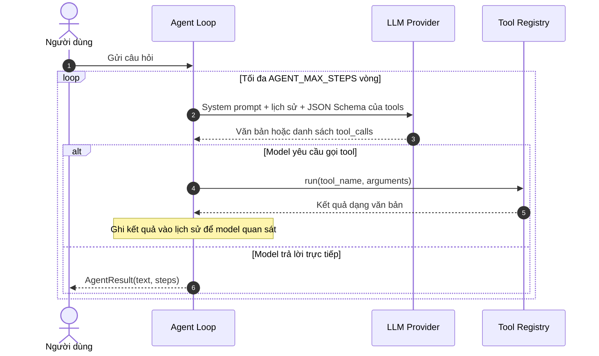

<div align="center">


# AI Agent From Zero

### Xây dựng AI Agent đa công cụ, đa nhà cung cấp LLM — từ những thành phần cơ bản nhất

Một project Python nhỏ gọn giúp bạn nhìn rõ cách một AI Agent **suy luận → gọi tool → quan sát kết quả → trả lời**, thay vì để framework che giấu toàn bộ quá trình.

[](https://www.python.org/)
[](https://streamlit.io/)
[](#nha-cung-cap-llm)
[](#kien-truc-he-thong)
[](https://github.com/breslee1707/AI_AGENT_FROM_ZERO/stargazers)

**[Bắt đầu nhanh](#bat-dau-nhanh) · [Kiến trúc](#kien-truc-he-thong) · [Cách hoạt động](#agent-hoat-dong-nhu-the-nao) · [Thêm tool](#them-tool-moi) · [Xử lý lỗi](#xu-ly-loi-thuong-gap)**

</div>

---

<a id="tong-quan"></a>
## Tổng quan

Một LLM thông thường chủ yếu sinh văn bản. Project này bổ sung cho LLM một **vòng lặp Agent** và một **bộ công cụ có kiểm soát**, để model có thể tự quyết định khi nào cần hành động.

Ví dụ với yêu cầu:

> “Đọc hóa đơn PDF, cộng các khoản rồi đổi tổng tiền sang USD.”

Agent có thể tự phối hợp ba tool theo đúng thứ tự:



### Vì sao project này hữu ích?

| Điểm nổi bật | Giá trị |
|---|---|
| **Minh bạch** | Xem được tool nào đã được gọi, tham số và kết quả của từng bước |
| **Phối hợp nhiều tool** | Kết quả của tool trước trở thành dữ liệu cho quyết định tiếp theo |
| **Đa nhà cung cấp** | Dùng cùng một Agent với Gemini, Claude hoặc OpenAI |
| **Dễ mở rộng** | Thêm tool mới bằng một `ToolSpec`, không cần sửa vòng lặp Agent |
| **Có lớp an toàn cơ bản** | Giới hạn số bước, bắt lỗi tool và máy tính không dùng `eval()` |
| **Hai cách sử dụng** | Giao diện web Streamlit và CLI trong terminal |
| **Hội thoại nhiều lượt** | Agent giữ lịch sử cho đến khi người dùng đặt lại cuộc trò chuyện |

> Đây là project học tập: code ưu tiên sự rõ ràng, dễ đọc và dễ thử nghiệm hơn độ phức tạp của một hệ thống production.

<a id="kien-truc-he-thong"></a>
## Kiến trúc hệ thống

Project tách phần điều phối Agent khỏi SDK của từng hãng. Mọi provider đều được chuyển về cùng một định dạng tin nhắn chuẩn hóa, nhờ đó `Agent` không cần biết model phía sau là Gemini, Claude hay OpenAI.



### Vai trò của từng thành phần

| Thành phần | Trách nhiệm |
|---|---|
| `app.py` | Hiển thị chat, trạng thái gọi tool, lịch sử và cấu hình đang dùng |
| `agent_core/agent.py` | Quản lý lịch sử hội thoại và vòng lặp điều phối tool |
| `agent_core/prompts.py` | Quản lý system prompt mặc định, tách khỏi logic điều phối |
| `agent_core/providers.py` | Chuyển đổi định dạng chung sang API của Gemini, Anthropic và OpenAI |
| `agent_core/tools/` | Chứa kiểu dữ liệu chung, registry và implementation riêng của từng tool |
| `agent_core/config.py` | Đọc `.env`, kiểm tra provider và API key đang hoạt động |
| `scripts/chat_cli.py` | Chạy Agent trực tiếp trong terminal để thử nghiệm nhanh |

<a id="agent-hoat-dong-nhu-the-nao"></a>
## Agent hoạt động như thế nào?

Mỗi câu hỏi đi qua chu trình **Think → Act → Observe**. Model có thể trả lời ngay, gọi một tool, hoặc gọi nhiều tool song song trong cùng một lượt. Sau khi nhận kết quả tool, model tiếp tục quyết định cho đến khi có câu trả lời cuối hoặc chạm giới hạn `AGENT_MAX_STEPS`.



`steps` lưu lại tên tool, tham số và kết quả của mỗi lần gọi. Streamlit dùng dữ liệu này để hiển thị mục **“Agent đã làm gì?”** dưới câu trả lời.

<a id="bat-dau-nhanh"></a>
## Bắt đầu nhanh

### Yêu cầu

- Python **3.10+**
- Một API key của **Gemini**, **Anthropic** hoặc **OpenAI**
- Git và PowerShell nếu dùng script cài đặt nhanh trên Windows

### 1. Clone repository

```bash
git clone https://github.com/breslee1707/AI_AGENT_FROM_ZERO.git
cd AI_AGENT_FROM_ZERO
```

### 2. Cài đặt

<details open>
<summary><strong>Windows — cách nhanh nhất</strong></summary>

```powershell
.\run.ps1
```

Script sẽ tạo `.venv`, cài dependencies, tạo `.env` từ file mẫu nếu cần và mở Streamlit. Lần chạy đầu tiên, hãy điền API key vào `.env` rồi chạy lại script.

</details>

<details>
<summary><strong>Windows — cài đặt thủ công</strong></summary>

```powershell
python -m venv .venv
.\.venv\Scripts\Activate.ps1
pip install -r requirements.txt
Copy-Item .env.example .env
```

</details>

<details>
<summary><strong>macOS / Linux</strong></summary>

```bash
python3 -m venv .venv
source .venv/bin/activate
pip install -r requirements.txt
cp .env.example .env
```

</details>

### 3. Cấu hình API key

Mở `.env`, chọn một provider và điền key tương ứng:

```dotenv
LLM_PROVIDER=gemini

GEMINI_API_KEY=your_api_key_here
GEMINI_MODEL=gemini-flash-latest
```

> **Bảo mật:** `.env` đã được thêm vào `.gitignore`. Không commit, chụp màn hình hoặc chia sẻ API key công khai.

### 4. Chạy ứng dụng

Giao diện web:

```bash
streamlit run app.py
```

CLI — hỏi một câu rồi thoát:

```bash
python scripts/chat_cli.py "15% của 2.000.000 là bao nhiêu, rồi đổi sang USD?"
```

CLI — trò chuyện liên tục:

```bash
python scripts/chat_cli.py
```

<a id="cach-su-dung"></a>
## Cách sử dụng

Thử các prompt sau để quan sát cách Agent chọn và phối hợp công cụ:

| Prompt mẫu | Luồng dự kiến |
|---|---|
| `100 USD đổi ra bao nhiêu VND?` | `convert_currency` |
| `15% của 2.000.000 là bao nhiêu?` | `calculator` |
| `15% của 2.000.000 là bao nhiêu, rồi đổi sang USD?` | `calculator` → `convert_currency` |
| `Đọc file D:/Documents/hoa-don.pdf và tóm tắt nội dung` | `read_pdf` |
| `Đọc hóa đơn PDF, cộng các khoản rồi đổi sang USD` | `read_pdf` → `calculator` → `convert_currency` |
| `Xin chào, bạn có thể làm gì?` | Trả lời trực tiếp, không cần tool |

Trong giao diện Streamlit:

1. Thanh bên hiển thị provider, model và danh sách tool hiện tại.
2. Trạng thái xử lý cập nhật ngay khi Agent gọi hoặc nhận kết quả từ tool.
3. Mỗi câu trả lời có thể mở rộng để xem toàn bộ dấu vết thực thi.
4. Nút **“Xóa hội thoại”** đặt lại cả lịch sử giao diện và bộ nhớ của Agent.

<a id="nha-cung-cap-llm"></a>
## Nhà cung cấp LLM

Chỉ cần đổi `LLM_PROVIDER` trong `.env`; vòng lặp Agent và các tool không thay đổi.

| Provider | Giá trị cấu hình | Biến API key | Model mặc định trong project |
|---|---|---|---|
| Google Gemini | `gemini` | `GEMINI_API_KEY` | `gemini-flash-latest` |
| Anthropic Claude | `anthropic` | `ANTHROPIC_API_KEY` | `claude-opus-4-8` |
| OpenAI | `openai` | `OPENAI_API_KEY` | `gpt-4o-mini` |

Ví dụ chuyển sang Anthropic:

```dotenv
LLM_PROVIDER=anthropic
ANTHROPIC_API_KEY=your_api_key_here
ANTHROPIC_MODEL=claude-haiku-4-5
```

> Tên model, quyền truy cập và chi phí phụ thuộc tài khoản của từng nhà cung cấp. Nếu model mặc định không khả dụng, hãy đổi biến `*_MODEL` sang model mà tài khoản của bạn được cấp.

<a id="cau-hinh"></a>
## Cấu hình

| Biến | Mặc định | Mô tả |
|---|---:|---|
| `LLM_PROVIDER` | `gemini` | Provider đang hoạt động: `gemini`, `anthropic` hoặc `openai` |
| `GEMINI_MODEL` | `gemini-flash-latest` | Model dùng bởi Gemini adapter |
| `ANTHROPIC_MODEL` | `claude-opus-4-8` | Model dùng bởi Anthropic adapter |
| `OPENAI_MODEL` | `gpt-4o-mini` | Model dùng bởi OpenAI adapter |
| `AGENT_TEMPERATURE` | `0.2` | Độ ngẫu nhiên thấp để quyết định gọi tool ổn định hơn |
| `AGENT_MAX_STEPS` | `5` | Số vòng suy luận tối đa cho mỗi yêu cầu |
| `AGENT_MAX_TOKENS` | `2048` | Giới hạn token đầu ra mỗi lượt ở adapter có sử dụng giá trị này |

Project chỉ yêu cầu API key của provider đang được chọn; key của hai provider còn lại có thể để trống.

### Quản lý prompt

System prompt mặc định nằm riêng tại `agent_core/prompts.py`, giúp thay đổi chỉ dẫn cho model mà không chạm vào vòng lặp điều phối. Có thể sửa prompt mặc định cho toàn ứng dụng hoặc truyền một prompt khác khi khởi tạo Agent:

```python
from agent_core import Agent

agent = Agent(
    client=client,
    registry=registry,
    system_prompt="Bạn là trợ lý phân tích tài liệu và luôn trích dẫn nguồn.",
)
```

Với nhiều persona hoặc use case, hãy khai báo thêm các hằng prompt trong `prompts.py` và chọn prompt tại composition root (`app.py` hoặc CLI), thay vì đặt chuỗi prompt rải rác trong code.

<a id="bo-cong-cu"></a>
## Bộ công cụ mặc định

| Tool | Input chính | Công dụng | Giới hạn hiện tại |
|---|---|---|---|
| `read_pdf` | `path`, `max_chars` | Trích xuất văn bản từ PDF cục bộ | Mặc định lấy 4.000 ký tự đầu; không OCR file scan |
| `calculator` | `expression` | Tính biểu thức số học bằng AST | Chỉ cho phép số và các toán tử cơ bản |
| `convert_currency` | `amount`, `from_currency`, `to_currency` | Quy đổi USD, VND, EUR, JPY, GBP, CNY | Dùng bảng tỷ giá minh họa cố định, không phải dữ liệu thời gian thực |

### Một số quyết định thiết kế

- **Máy tính dùng AST:** từ chối tên biến, gọi hàm và câu lệnh tùy ý; an toàn hơn nhiều so với chạy `eval()` trên dữ liệu do model tạo.
- **Tool luôn trả về chuỗi:** cả kết quả thành công lẫn lỗi đều có thể được LLM đọc và phản hồi ở vòng tiếp theo.
- **Giới hạn số bước:** ngăn Agent lặp vô hạn, treo ứng dụng hoặc tiêu thụ quota ngoài ý muốn.
- **Adapter chuẩn hóa provider:** một vòng lặp Agent dùng chung cho ba SDK khác nhau.
- **Tắt automatic function calling của Gemini:** project tự điều khiển vòng lặp để người học quan sát được từng bước.
- **Giữ `thought_signature` của Gemini:** chữ ký được phát lại cùng function call ở lượt sau theo yêu cầu của SDK/model tương ứng.

<a id="them-tool-moi"></a>
## Thêm tool mới

Mỗi tool nằm trong một module riêng và gồm bốn phần: tên, mô tả để model biết **khi nào nên gọi**, JSON Schema của tham số và hàm Python thực thi.

Ví dụ tạo `agent_core/tools/current_time.py`:

```python
from datetime import datetime

from .base import ToolSpec


def get_current_time() -> str:
    return datetime.now().astimezone().isoformat()


CURRENT_TIME_TOOL = ToolSpec(
    name="get_current_time",
    description="Trả về thời gian hiện tại khi người dùng hỏi ngày hoặc giờ.",
    parameters={
        "type": "object",
        "properties": {},
    },
    func=get_current_time,
)
```

Sau đó đăng ký spec tại `agent_core/tools/defaults.py`:

```python
from .current_time import CURRENT_TIME_TOOL

DEFAULT_TOOLS = (
    PDF_READER_TOOL,
    CALCULATOR_TOOL,
    CURRENCY_TOOL,
    CURRENT_TIME_TOOL,
)
```

Tool mới sẽ tự động xuất hiện trong sidebar và được chuyển sang định dạng phù hợp với provider đang dùng. Bạn không cần sửa `agent.py`, provider adapters hay UI.

<a id="cau-truc-thu-muc"></a>
## Cấu trúc thư mục

```text
AI_AGENT_FROM_ZERO/
├── agent_core/
│   ├── tools/
│   │   ├── __init__.py      # Public API ổn định của tools package
│   │   ├── base.py          # ToolSpec trung lập với provider
│   │   ├── registry.py      # Đăng ký và thực thi tool an toàn
│   │   ├── defaults.py      # Danh sách tool bật mặc định
│   │   ├── calculator.py    # Máy tính giới hạn bằng AST
│   │   ├── currency.py      # Quy đổi tiền tệ minh họa
│   │   └── pdf_reader.py    # Trích xuất văn bản PDF
│   ├── __init__.py          # Public API và phiên bản package
│   ├── agent.py             # Vòng lặp Agent và lịch sử hội thoại
│   ├── prompts.py           # System prompts dùng bởi Agent
│   ├── config.py            # Đọc và kiểm tra cấu hình môi trường
│   └── providers.py         # Adapter Gemini / Anthropic / OpenAI
├── scripts/
│   └── chat_cli.py          # Giao diện dòng lệnh
├── app.py                   # Giao diện chat Streamlit
├── run.ps1                  # Cài đặt và chạy nhanh trên Windows
├── requirements.txt         # Python dependencies
├── .env.example             # Mẫu cấu hình, không chứa secret
├── .gitignore
└── README.md
```

Để đọc code theo luồng dễ hiểu nhất: `config.py` → `prompts.py` → `tools/` → `providers.py` → `agent.py` → `app.py`.

<a id="gioi-han-va-an-toan"></a>
## Giới hạn và lưu ý an toàn

- `convert_currency` phục vụ demo luồng tool; **không dùng kết quả cho giao dịch tài chính**.
- `read_pdf` chỉ đọc PDF chứa lớp văn bản. PDF ảnh scan cần thêm OCR.
- Đường dẫn PDF được Agent mở trên chính máy đang chạy ứng dụng; chỉ sử dụng file bạn tin cậy.
- Nội dung PDF được gửi tới provider LLM trong lịch sử hội thoại. Không dùng tài liệu nhạy cảm nếu chưa đánh giá chính sách dữ liệu của provider.
- Project chưa có sandbox riêng cho tool tùy chỉnh. Hãy kiểm tra chặt input và quyền truy cập khi thêm tool có tác động hệ thống.
- Lịch sử nằm trong bộ nhớ tiến trình, chưa được lưu bền vững sau khi ứng dụng khởi động lại.

<a id="xu-ly-loi-thuong-gap"></a>
## Xử lý lỗi thường gặp

| Hiện tượng | Nguyên nhân thường gặp | Cách xử lý |
|---|---|---|
| `Thiếu ..._API_KEY` | Chưa tạo `.env` hoặc chọn sai provider | Sao chép `.env.example`, điền key và kiểm tra `LLM_PROVIDER` |
| `ModuleNotFoundError` | Chưa cài dependencies hoặc chưa kích hoạt `.venv` | Kích hoạt môi trường ảo rồi chạy `pip install -r requirements.txt` |
| `Không tìm thấy file` | Đường dẫn PDF sai hoặc app không có quyền đọc | Dùng đường dẫn tuyệt đối và kiểm tra quyền truy cập |
| PDF không trích được chữ | PDF là ảnh scan | Chạy OCR trước hoặc bổ sung một OCR tool |
| Lỗi model không tồn tại | Tài khoản không có quyền với model đã cấu hình | Đổi biến `*_MODEL` trong `.env` |
| `429`, quota hoặc rate limit | Hết quota hoặc gửi quá nhiều yêu cầu | Chờ rồi thử lại, đổi model hoặc kiểm tra billing |
| Agent dừng trước khi xong | Đã chạm `AGENT_MAX_STEPS` | Viết prompt rõ hơn hoặc tăng giới hạn có kiểm soát |

<a id="bai-tap-mo-rong"></a>
## Bài tập mở rộng

- [ ] Thêm tool `get_current_time` không cần API bên ngoài.
- [ ] Thay bảng tỷ giá cố định bằng một API tỷ giá thời gian thực.
- [ ] Thêm OCR cho PDF scan.
- [ ] Kết nối `search_knowledge_base` để biến pipeline RAG thành một tool.
- [ ] Lưu lịch sử hội thoại vào SQLite.
- [ ] Thêm timeout, retry và telemetry cho mỗi lần gọi tool.
- [ ] Viết unit test cho `calculator`, `ToolRegistry` và vòng lặp Agent.
- [ ] Chạy tool trong sandbox trước khi dùng cho môi trường production.

<a id="dong-gop"></a>
## Đóng góp

Issue và pull request đều được chào đón. Một luồng đóng góp gợi ý:

```bash
git checkout -b feature/ten-tinh-nang
git commit -m "feat: mô tả thay đổi"
git push origin feature/ten-tinh-nang
```

Khi thêm provider hoặc tool mới, hãy giữ interface chuẩn hóa hiện tại và bổ sung ví dụ sử dụng vào README.

---

<div align="center">

Được xây dựng để học cách AI Agent thực sự điều phối công cụ — từng bước một.

Nếu project hữu ích, hãy star repository để ủng hộ series.

</div>
